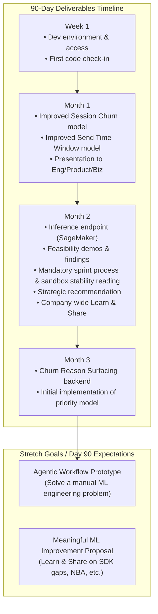

# **Juan Jose Iguaran Fernandez 90-Day Plan: Machine Learning Engineer**

**Start date:** Sep 21, 2026  
**Reports to:** Joey Rahman  
**Onboarding Buddy:** Joey Rahman

# **Welcome to the Team**

JuanJo, we are super excited to be working with you and can't wait to see what you accomplish You are joining us at a pivotal moment, and your role here is critical to our success. We want you to feel fully supported and empowered from day one.

## **Who to go to for what**

To make sure you never get stuck, here is your support network:

- **Technical questions:** Go to your onboarding buddy. They are here to help you get unblocked quickly.  
- **Legacy Architecture-related questions:** Go to Carl. 
- **Data Platform related questions: Joey**
- **Team-related or HR questions:** Come to **me (Joey)**. If it's an HR question I can't address directly, I will forward you to Sarah.

## **Core Operating Expectations**

To set you up for success, here are our core operating expectations and engineering values:

- **The Importance of Communication:** Bias towards over-communication at the start. Share your thinking and work early. Tag co-workers on Slack, and if you aren't getting responses, feel empowered to schedule time directly with them.  
- **Ownership & Accountability:** This is not a job where you just code, build models, and go home. You're smart We expect you to proactively come up with initiatives and ideas, drive them forward, and take accountability for the outcomes. Learn from your setbacks.  
- **Data-Driven Culture:** We expect you to help the organization think differently about our data. Don't just solve the tickets given to you; look beneath the surface. Proactively identify opportunities (e.g., "If we collect this new event from the SDK, it will improve our churn model by X" or "Here is a trendy end-of-year data wrap-up we could do"). You can expect full cooperation and support from Leadership in driving these initiatives.
- **Integrity:** Be reliable and deliver on your commitments. This is the foundation for establishing deep trust and credibility within the engineering organization.

# **90-Day Objective**

By the end of 90 days, you will have delivered **production-ready models and APIs** that anchor our Behavioral Predictions product line, evaluated the feasibility of next-generation **App-Feature Intelligence churn models**, and built the core intelligence engine for **Churn Reason Surfacing**. 

# **Week 1  Ship Something & Secure Access**

## **Goal**

Become familiar with the complete engineering workflow by taking a small code change all the way through the development and deployment process, and ensure you have all the access and permissions needed to operate independently.

## **Deliverables**

- Complete development environment and repository setup.  
- Verify and secure all necessary access and permissions across our tools, environments, and repos.  
- **Meet half of the engineering team in 1:1s.**  
- **Have three 1:1s with your onboarding buddy.** In these sessions, have them walk you through the codebase and data pipelines so you leave Week 1 knowing where the product, models, and related code live.  
- **Ask Pedro for a very simple bug or task to ship, and make your first code check-in during Week 1**  
- Follow the normal engineering lifecycle:  
  - Branch / code  
  - Pull request  
  - Code review  
  - CI/CD  
  - Deployment  
  - Production verification  
  - Merge to main

## **Success Criteria**

By the end of Week 1, you have shipped code through the same process that feature engineers use and understand at a practical level **how code gets to production**.

# **Month 1  Behavioral Predictions API (Session Churn & Send Time Window)**

## **Objective**

Deliver production-ready models and data pipelines to serve the first version of the Behavioral Predictions API.

## **Weeks 2 & 3 - Session Churn & Send Time Window Models**

- **Meet the other half of the engineering team in 1:1s.**  
- **Meet with Joey multiple times as needed** to understand current work done, pipeline design and tooling for behavioral predictions and build on top of that.
- **Prepare a presentation for the ENgineering team explaining the NUtracheck data taxonomy**  
- Deep dive into the **Behavioral Predictions API PRD**. Understand the contract: how models are versioned, how predictions are typed (`value_type`), and how they are retrieved synchronously and asynchronously.
- **Improve Model Performance** for the existing session churn model (30-day app opens) and the send_time_window model:
  - Define performance metrics
  - Improve performance

## **End of Month Deliverable**

- **Present to Engineering, Product, and Business** the ML models you have improved. This presentation should cover:
  - Problem framing
  - Performance
  - Design
  - Tooling
  - Cost
  - Governance
  - Future work
- **Get approval from Joey** on the content of what you will be presenting.

# **Month 2  App-Feature Intelligence & Strategic ML Roadmap**

## **Objective**

Evaluate the feasibility and performance of App-Feature Intelligence based churn models built for key customers (GoPro and Verizon), and develop a strategic ML roadmap for future use cases.

## **Activities**

**Week 5 - Inference Infrastructure:**

- Work on the inference endpoint.
- Collaborate with the Data Platform engineer (Joey, if we are not able to hire by then) to figure out offline and online feature stores.
- Design and implement async inference with SageMaker workers.
- Design and implement runtime inference.
- **Mandatory reading:**
  - [Engineering Sprint Process](https://github.com/localytics/engineering-playbook/blob/main/delivery/sprint-process.md)
  - [Sandbox Deployment and Stability Conventions](https://github.com/localytics/engineering-playbook/blob/main/workflow/sandbox-and-stability.md)

**Week 6 - App-Feature Intelligence Churn Models:**

- Dive into the `[feature-analysis](https://github.com/localytics/feature-analysis)` repository and existing SQL scripts for GoPro and Verizon.
- Analyze the event lifecycle, coverage profiling, and Analytical Base Table (ABT) generation for these customers.
- Train and evaluate churn models leveraging these specific App-Feature Intelligence features.
- Compare the performance of these models against our baseline churn models.
- Identify any data quality, latency, or computational cost issues associated with scaling these models, including the human effort required to keep these models performing well.

**Weeks 7-8 - Feasibility of Strategic ML Roadmap:**

- **Meet with the Head of Product (Juan)** and **Head of Operations (Derick)**.
- Gather guidance on customers' data and ML needs for advanced use cases, including:
  - App-Feature Analysis
  - Uplift measurement
  - Segmentation
  - Optimizing A/B Tests & Bandits (e.g., starting with simple exploitation like automated push-to-campaign flows for Shopfully, then evolving to contextual bandits)
  - Message Fatigue
  - Seasonality / Retail Load Optimization (e.g., Q4 optimizations for GoPro)
- Evaluate the technical feasibility of these use cases. This requires prototyping them; it doesn't have to be scalable with full-fledged ML infra and governance. This is meant to be a feasibility exercise based on engineering effort, customer demand, model quality, and cost.

## **Month 2 Deliverables**

- **Inference Infrastructure:** A working inference endpoint, including offline/online feature store architecture and async/runtime inference via SageMaker workers.
- **Feasibility Demos & Findings:** Multiple demos and findings from the feasibility study covering the App-Feature Intelligence churn models and the advanced ML use cases (Uplift, Segmentation, Bandits, etc.).
- **Strategic Recommendation:** A defense of why we should proceed with productionizing certain models over others, based on engineering effort, customer demand, model quality, and cost.
- **Company-Wide "Learn & Share" Session:** Host a presentation for the broader organization showcasing the "Art of the Possible." This session should highlight what our current data is telling us, what we could build with it, and how we can elevate our data maturity beyond transactional ticket-solving.

# **Month 3  Churn Reason Surfacing & Strategic Model Implementation**

## **Objective**

Build the intelligence backend for the Churn Reason Surfacing MVP, enabling zero-configuration churn driver discovery. Additionally, begin implementation of the highest-priority model identified during the Month 2 feasibility study.

## **Activities**

**Churn Reason Surfacing:**

- Deep dive into the **Churn Reason Surfacing PRD**. Understand the shift from "who will churn" to "why are they churning."
- Develop the automated analysis engine that scans a customer's full event library against the default churn definition (30 days of inactivity).
- Implement the statistical logic to identify and rank the specific behaviors (events performed or not performed) most predictive of churn.
- Calculate the relative risk magnitude (e.g., "3.2x more likely to churn") and confidence indicators for each driver.
- Ensure the engine's output can be easily translated into the plain-language insight cards required by the frontend.
- Optimize the computational cost of scanning the full event library to ensure results are available within a reasonable time.

**Strategic Model Implementation & Next Best Action:**

- Begin building the first model that was declared feasible and sequenced as the highest priority from your Month 2 evaluation (e.g., Uplift, Segmentation, Bandits, etc.).
- Integrate this model into the inference infrastructure built in Month 2.
- Deep dive into Next Best Action (NBA) and reinforcement learning-based decisioning systems to lay the groundwork for future advanced personalization capabilities.

## **Month 3 Deliverable**

- **Production-ready intelligence backend** for the Churn Reason Surfacing MVP, capable of automatically surfacing and ranking churn drivers without requiring manual model configuration or data science expertise from the customer.
- **Initial implementation** of the highest-priority strategic model evaluated in Month 2.

# **AI-Forward ML Engineering & Strategic Proposal - Day 90 Expectation**

By the end of the third month, you must deliver on two forward-looking initiatives:

1. **Agentic Workflow:** Identify and prototype **one meaningful use of an AI agent or agentic workflow within the Data/ML domain**.
  - The requirement is deliberately **not**: *"Build an AI agent to increase AI usage."*
  - Instead: **Identify an expensive, manual, or ineffective ML engineering problem, define a measurable outcome, and determine whether an agentic workflow is an effective mechanism for improving it.**
  - *Examples:* Recommending retrain or auto-retrain triggers based on concept/model drift, an agent to autonomously evaluate model performance and flag anomalies, or building automated weekly reports summarizing the health and performance of our production models.
  - The proposal must start with a non-AI success metric (e.g., *Problem:* ML Engineers spend 4 hours a week manually compiling model performance reports. *Success metric:* Reduce weekly reporting time from 4 hours to zero).
2. **Meaningful ML Improvement Project Proposal:** Propose a highly specific, meaningful ML improvement project based on your exposure to our data over the first couple of months.
  - This must be delivered as a cross-functional **"Learn and Share" session** to Engineering, Product, and Business.
  - The presentation must explicitly cover:
    - Gaps in our current telemetry (e.g., specific events we need to collect from the SDK).
    - How filling these gaps unlocks advanced capabilities like [Next Best Action (NBA)](https://www.bcg.com/capabilities/marketing-sales/personalization) and more effective churn interventions.
    - A concrete recommendation for where we should invest next to elevate our data-driven capabilities.

# **Day-90 Definition of Success**

At the end of 90 days, you should be able to demonstrate:

1. **Product Understanding:** You understand the critical customer journeys, API contracts, and the value of shifting from predictive scoring to actionable insights.
2. **Production Impact:** You have successfully deployed the Session Churn and Send Time Window models, anchoring the Behavioral Predictions API.
3. **Analytical Rigor:** You have rigorously evaluated the GoPro and Verizon App-Feature Intelligence models and provided a clear path forward.
4. **Product Innovation:** You have built the core engine for Churn Reason Surfacing, delivering a highly differentiated, zero-configuration insights product.
5. **Engineering Excellence:** Your models and pipelines are robust, scalable, and fully integrated into the engineering release workflow.
6. **Outcome-driven AI adoption & Strategic Vision:** You have identified and designed an agentic workflow to solve a real Data/ML engineering problem, AND you have proposed a highly specific, meaningful ML improvement project to the broader organization.

